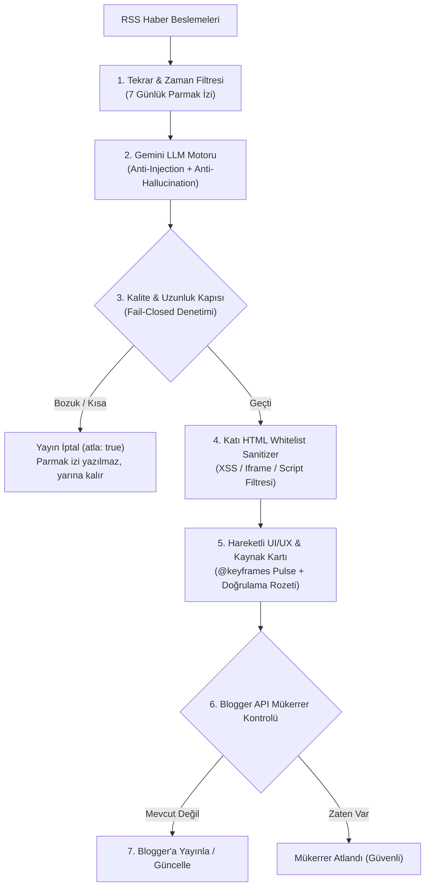

# Giant Automation Library

> Voyagerroc-Automation ekosisteminin **n8n iş akışı kütüphanesi**: içe aktarılmaya hazır, kurumsal düzeyde doğrulanmış ve güvenlik sertleştirmesi yapılmış (Red Team Hardened) workflow JSON dosyaları ve bunları denetleyen araçlar.

Bu depo kod çalıştırmaz; **kaynak-doğruluk (source of truth)** deposudur. n8n iş akışları burada sürümlenir, `npm run validate` ve `npm test` ile yapısal ve mantıksal olarak doğrulanır ve [infrastructure](https://github.com/Voyagerroc-Automation/infrastructure) deposundaki n8n konteynerine salt okunur olarak (`/workflows`) bağlanır.

---

## İş Akışı Koleksiyonu

Şu anda `workflows/` altında **7 doğrulanmış ve sertleştirilmiş iş akışı** bulunur:

| Dosya | Tetikleyici | Ne yapar |
| :--- | :--- | :--- |
| `01-video-generation/seedance-2.5-3shot-pipeline.json` | Webhook | Code node'unda Seedance 2.5 + VEO3 birleşik prompt motorunu çalıştırır, sonucu Media Engine'e HTTP ile gönderir |
| `01-video-generation/ugc-factory-sora2-template.json` | Form | Ürün görselini base64'e çevirir, GPT ile persona + reklam promptları üretir, Sora 2 ile video oluşturup Google Drive'a yükler (durum kontrolü + bekleme döngüsüyle) |
| `01-video-generation/ecommerce-bestseller-veo3-pipeline.json` | Haftalık zamanlayıcı | Algolia'dan haftanın çok satanını çeker, görseli doğrular (eksikse Gmail ile admin'e haber verir), Google VEO 3 ile video üretir, MP4'ü Supabase bucket'a atıp Algolia'da indeksler |
| `02-social-distribution/youtube-shorts-publisher.json` | Webhook | Metadata/SEO'yu Code node'unda biçimlendirir ve videoyu YouTube Shorts Pipeline servisine HTTP ile iletir |
| `03-content-creation/ai-haber-blog-otomasyonu.json` | Günlük zamanlayıcı (09:00) + Webhook | RSS kaynaklarından haber seçer, Gemini (5000 token) ile **uzun formatlı (800-1400+ kelime)** derin analiz üretir, hareketli UI/UX teması ve XSS/Prompt sanitizer korumasıyla Blogger'a yayınlar |
| `03-content-creation/mevcut-yazilari-yeniden-tasarla.json` | Webhook | Mevcut Blogger yazılarını uzun format ve modern hareketli UI/UX temasıyla günceller, Wikimedia/Openverse görselleriyle zenginleştirir |
| `05-monitoring-audit/audit-trail-logger.json` | Webhook | Gelen olayı yapılandırıp Open-LLM-Audit-Trail denetim veritabanına HTTP ile kaydeder |

---

## 🛡️ Red Team Güvenlik ve Dayanıklılık Sertifikasyonu

Blog ve içerik otomasyonu (`03-content-creation`) iş akışları aşağıdaki çok katmanlı savunma kalkanlarıyla donatılmıştır:



### Güvenlik Önlemleri Matrisi:

1. **Katı HTML Whitelist Sanitizer:**
   - `<script>`, `<iframe>`, `<object>`, `<embed>`, `<form>`, `<input>`, inline `on*` eventleri ve `javascript:` URL protokolleri kesin olarak filtrelenir.
   - Yalnızca güvenli etiketler (`<p>`, `<h3>`, `<ul>`, `<li>`, `<strong>`, `<em>`, `<blockquote>`, `<a>`) geçirilir.
   - Dış bağlantılar otomatik olarak `rel="nofollow noopener"` ve `target="_blank"` standartlarına bağlanır.

2. **Prompt Injection & Halüsinasyon Kalkanı:**
   - RSS başlık veya gövdelerinden gelebilecek komut enjeksiyonları sistem kurallarıyla yalıtılmıştır.
   - Modelin uydurma rakam, sahte kişi veya asılsız şirket ismi üretmesini engelleyen editoryal analiz direktifleri tanımlanmıştır.

3. **Güvenli URI ve Görsel Kodlama:**
   - Pollinations.ai ve Openverse görsel sorguları `encodeURIComponent` öncesinde karakter sınırına tabi tutulur; UTF-8 çok baytlı karakterlerin ortadan bölünerek sunucu hatası (`Malformed URI`) üretmesi engellenmiştir.

4. **Fail-Closed Hata Yönetimi:**
   - Gemini API kesintilerinde (503/429), token tükenmesinde veya bozuk JSON çıktılarında akış sessizce yayını durdurur (`atla: true`). Eksik, yarım veya İngilizce ham metin bloga **asla basılmaz**.

5. **Mükerrer ve Yarış Koşulu Koruması (Race Condition Guard):**
   - 30 dakikalık koşu kilidi + 7 günlük parmak izi önbelleği + `BLOG-BEKCISI.ps1`'in 08:30-09:35 sessiz penceresi + Blogger API arama doğrulaması.

---

## 🎨 UI/UX & Blog Tasarım Özellikleri

- **Canlı Radar Göstergesi:** `@keyframes pulseSignal` ile nabız gibi atan canlı durum göstergesi (`🟢 CANLI AI SİNYALİ · DERİNLEMESİNE RAPOR`).
- **Yönetici Özeti (Executive Summary) Veri Paneli:** Öne çıkan 4 kritik bulguyu ve sayısal verileri gösteren koyu slate veri kartı.
- **Bölüm Sayaçları & Tipografi:** `01 / BÖLÜM` sayaçları, gradyan sol çizgi vurguları, 17.5px ferah okuma puntosu.
- **Doğrulanmış Haber Kaynağı Kartı:** Orijinal haber ajansı (TechCrunch, The Verge, MIT Tech Review vb.) atfı, yayın tarihi ve orijinal makaleye giden şık buton.
- **Türkiye Ekosistem Analizi:** Gelişmenin Türkiye'deki geliştiricilere ve şirketlere yansımalarını açıklayan odak paneli.

---

## Başlangıç ve Doğrulama

```bash
# Tüm iş akışlarını yapısal olarak doğrular (düğüm, tip ve bağlantı kontrolü)
npm run validate

# Tüm Code node'larını sanal n8n ortamında simüle ederek uçtan uca test eder
npm test

# Senkronizasyon öncesi doğrulama
npm run sync
```

**n8n'e içe aktarma:**

1. n8n arayüzünü açın (`http://localhost:5678` — [infrastructure](https://github.com/Voyagerroc-Automation/infrastructure) ile ayağa kalkar).
2. **Workflows → Import from File** seçin ve `workflows/` altındaki `.json` dosyasını yükleyin.
3. Alternatif: infrastructure compose dosyası bu depoyu n8n konteynerine `/workflows` olarak zaten bağlar.

> Not: İş akışlarındaki kimlik bilgileri (Gmail, Google Drive, OpenAI vb.) JSON'a gömülü değildir; içe aktardıktan sonra n8n **Credentials** bölümünden tanımlanmalıdır.

---

## Depo Yapısı

```
workflows/
  01-video-generation/     # 3 video üretim hattı (Seedance, Sora 2, VEO 3)
  02-social-distribution/  # YouTube Shorts yayınlayıcı
  03-content-creation/     # Sertleştirilmiş Blogger içerik otomasyonu (AI haber derlemesi, yazı yenileme)
  05-monitoring-audit/     # Denetim kaydı toplayıcı
scripts/
  validate-workflows.js    # Yapısal doğrulayıcı
  test-workflow-nodes.js   # Red Team & Code node simülasyon test takımı
  sync-workflows.js        # Doğrulamayı zorunlu kılan senkron sarmalayıcı
  BLOG-BEKCISI.ps1         # Docker açıkken AI Haber Derlemesi'ni 3 saatte bir otomatik tetikleyen Windows bekçisi
preview.html               # Canlı blog arayüzü görsel önizleme şablonu
```

---

## Ekosistemdeki Yeri

- [infrastructure](https://github.com/Voyagerroc-Automation/infrastructure) — bu iş akışlarını çalıştıran n8n/Postgres/Redis yığını
- [media-engine](https://github.com/Voyagerroc-Automation/media-engine) — video render isteklerinin hedefi
- [youtube-shorts-pipeline](https://github.com/Voyagerroc-Automation/youtube-shorts-pipeline) — yayınlama servisinin kendisi
- [open-llm-audit-trail](https://github.com/Voyagerroc-Automation/open-llm-audit-trail) — denetim olaylarının havuzu
- [automation-os](https://github.com/Voyagerroc-Automation/automation-os) — orkestrasyon beyni

---

© 2026 Voyagerroc Automation. MIT License.
