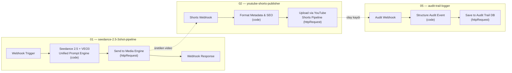

# Giant Automation Library

> Voyagerroc-Automation ekosisteminin **n8n iş akışı kütüphanesi**: içe aktarılmaya hazır, doğrulanmış workflow JSON dosyaları ve bunları denetleyen araçlar.

Bu depo kod çalıştırmaz; **kaynak-doğruluk (source of truth)** deposudur. n8n iş akışları burada sürümlenir, `npm run validate` ile yapısal olarak doğrulanır ve [infrastructure](https://github.com/Voyagerroc-Automation/infrastructure) deposundaki n8n konteynerine salt okunur olarak (`/workflows`) bağlanır.

---

## İş Akışı Koleksiyonu

Şu anda `workflows/` altında **5 doğrulanmış iş akışı** bulunur:

| Dosya | Tetikleyici | Ne yapar |
| :--- | :--- | :--- |
| `01-video-generation/seedance-2.5-3shot-pipeline.json` | Webhook | Code node'unda Seedance 2.5 + VEO3 birleşik prompt motorunu çalıştırır, sonucu Media Engine'e HTTP ile gönderir |
| `01-video-generation/ugc-factory-sora2-template.json` | Form | Ürün görselini base64'e çevirir, GPT ile persona + reklam promptları üretir, Sora 2 ile video oluşturup Google Drive'a yükler (durum kontrolü + bekleme döngüsüyle) |
| `01-video-generation/ecommerce-bestseller-veo3-pipeline.json` | Haftalık zamanlayıcı | Algolia'dan haftanın çok satanını çeker, görseli doğrular (eksikse Gmail ile admin'e haber verir), Google VEO 3 ile video üretir, MP4'ü Supabase bucket'a atıp Algolia'da indeksler |
| `02-social-distribution/youtube-shorts-publisher.json` | Webhook | Metadata/SEO'yu Code node'unda biçimlendirir ve videoyu YouTube Shorts Pipeline servisine HTTP ile iletir |
| `05-monitoring-audit/audit-trail-logger.json` | Webhook | Gelen olayı yapılandırıp Open-LLM-Audit-Trail denetim veritabanına HTTP ile kaydeder |

`templates/` ve `docs/` klasörleri şu an boştur (gelecekteki şablon ve doküman koleksiyonları için ayrılmış yer tutucular).

---

## Gerçek Akışlar (node'lardan türetilmiş)



---

## Başlangıç

```bash
npm run validate   # Tüm workflow JSON'larını yapısal olarak doğrular
npm run sync       # İçe aktarım öncesi doğrulama (validate'i çalıştırır)
```

Doğrulayıcı (`scripts/validate-workflows.js`) her dosyada şunları denetler: workflow adı, en az bir node, geçerli `connections` nesnesi, tekrarsız node isimleri ve var olmayan node'lara işaret eden bağlantılar.

**n8n'e içe aktarma:**

1. n8n arayüzünü açın (`http://localhost:5678` — [infrastructure](https://github.com/Voyagerroc-Automation/infrastructure) ile ayağa kalkar).
2. **Workflows → Import from File** seçin ve `workflows/` altındaki `.json` dosyasını yükleyin.
3. Alternatif: infrastructure compose dosyası bu depoyu n8n konteynerine `/workflows` olarak zaten bağlar.

> Not: İş akışlarındaki kimlik bilgileri (Gmail, Google Drive, OpenAI vb.) JSON'a gömülü değildir; içe aktardıktan sonra n8n **Credentials** bölümünden tanımlanmalıdır.

---

## Depo Yapısı

```
workflows/
  01-video-generation/     # 3 video üretim hattı (Seedance, Sora 2, VEO 3)
  02-social-distribution/  # YouTube Shorts yayınlayıcı
  05-monitoring-audit/     # Denetim kaydı toplayıcı
scripts/
  validate-workflows.js    # Yapısal doğrulayıcı
  sync-workflows.js        # Doğrulamayı zorunlu kılan senkron sarmalayıcı
templates/, docs/          # Boş (planlanan içerik)
```

---

## Ekosistemdeki Yeri

- [infrastructure](https://github.com/Voyagerroc-Automation/infrastructure) — bu iş akışlarını çalıştıran n8n/Postgres/Redis yığını
- [media-engine](https://github.com/Voyagerroc-Automation/media-engine) — video render isteklerinin hedefi
- [youtube-shorts-pipeline](https://github.com/Voyagerroc-Automation/youtube-shorts-pipeline) — yayınlama servisinin kendisi
- [open-llm-audit-trail](https://github.com/Voyagerroc-Automation/open-llm-audit-trail) — denetim olaylarının havuzu
- [automation-os](https://github.com/Voyagerroc-Automation/automation-os) — orkestrasyon beyni

---

© 2026 Voyagerroc Automation. MIT License.
