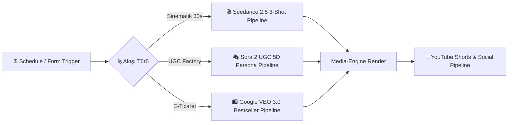

# ⚡ Giant Automation Library

> **Voyagerroc-Automation** ekosisteminin n8n iş akışları ve yapay zeka video fabrikası şablonları deposu.

---

## 🏛️ n8n İş Akışları ve Üretim Fabrikası Şeması

---

## 📂 Dahili İş Akışı Koleksiyonu

| İş Akışı Dosyası | Model / Entegrasyon | Açıklama |
| :--- | :--- | :--- |
| `seedance-2.5-3shot-pipeline.json` | Higgsfield / Seedance 2.5 | 3-Shot (30s), 8-elemanlı sinematik lens & yerel ses entegrasyonu |
| `ugc-factory-sora2-template.json` | OpenAI Sora 2 + GPT-4o | 5-Boyutlu persona + 12s dikey UGC video fabrikası |
| `ecommerce-bestseller-veo3-pipeline.json` | Algolia + Vertex AI VEO 3 | Haftalık en çok satan ürünü çekip otomatik video üreten pipeline |
| `youtube-shorts-publisher.json` | YouTube Data API v3 | Üretilen videoları otomatik etiketleyip yayınlayan dağıtım motoru |
| `audit-trail-logger.json` | Open-LLM-Audit-Trail | Tüm n8n olaylarının güvenlik denetim kaydını tutan akış |

---

## 📥 n8n'e İçe Aktarma
1. n8n arayüzünü açın (`http://localhost:5678`).
2. **Workflows ➔ Import from File** seçeneğini seçin.
3. `workflows/` klasöründeki dilediğiniz `.json` dosyasını seçip anında çalıştırın.

---
© 2026 Voyagerroc Automation. All rights reserved.